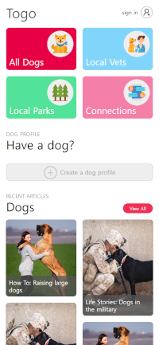

# Molson's Dev Blog - 1

### Table of contents
📝 [Post](#post-)\
💻 [TODO](#todo-)\
⏳ [T.L.D.R](#tldr-)

#
## Post 📝

In my previous post I mentioned who I am, what projects I am working on, and what I will be sharing in these blog posts. To start things off, this blog post will be focused on catching you up with what I have done so far in my project. PackFinder (now going to be referred to as Togo), has been in development for a little over a year now. In this post I will share what I have done so far, what tools I'm using, frameworks, and so on, as well as go over what I'm currently working on and the next steps in the TODO section.

As I mentioned in the first post, Togo is a mobile first [Progressive Web App (PWA)](https://developer.mozilla.org/en-US/docs/Web/Progressive_web_apps) focused on making adopting a dog easier and more fun. The core set of features I want to develop are:
- Searching for dogs in your area ready to adopt
- Finding local vets for your dog
- Finding local dog friendly parks
- Building a social media profile for your dog to share
- Searching for dog adoption events
- Creating dog adoption events if you are the host
- Provide educational articles for users to read
- Allow users of the app to find and direct message other users

There are a lot of features within each of those bullet points, specific to each Epic. Here are some screenshots of the app so far (All data is test data):

The tech stack for this app is:
- Frontend
  - [Nuxt.js](https://nuxtjs.org/)
  - [TailwindCSS](https://tailwindcss.com/)
  - [Ant Design](https://ant.design/)
  - PWA
  - [Sentry](https://sentry.io/welcome/)
  - [Heroku](https://www.heroku.com/products)
- Backend
  - REST API
  - [JWT authentication](https://jwt.io/)
  - Profile based authorization
  - [Golang](https://go.dev/)
  - [PostgreSQL](https://www.postgresql.org/)
  - [AWS S3](https://aws.amazon.com/s3/)
  - [Redis](https://redis.io/)
  - [Sentry](https://sentry.io/welcome/)
  - [CodeFactor](https://www.codefactor.io/)
  - [Heroku](https://www.heroku.com/products)

I use [Trello](https://trello.com/) to manage my project, and use as a Kanban board, Github to host my code and use for version control, and [Figma](https://www.figma.com/) for designing my application.

I'm currently updating all my manual CSS to use Tailwind instead. This will make all future development of components and pages much easier and cleaner. Since I have a lot of pages and components built out so far, it will definitely take a while, but soon after finishing this massive refactor I will implement Dark Mode for my application and Tailwind makes that process super easy!
#
## TODO 💻

Here is my current top 5 TODO items for Togo:
* [ ] Update all Nuxt.js CSS to use Tailwind
* [ ] Implement Dark Mode across all pages
* [ ] Add UI features for when it's a user dog's birthday
* [ ] Add ability to edit a user's dog profile
* [ ] Add share button on user's dog profile
#
## T.L.D.R ⏳

<!-- Put text here -->
#