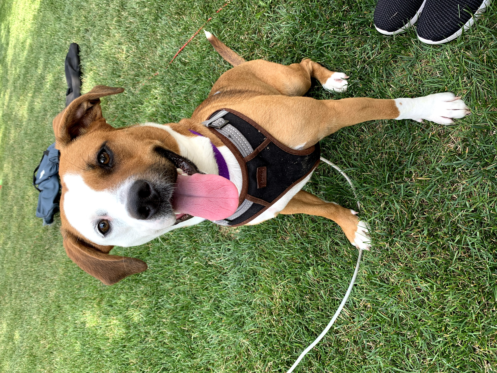

# Molson's Dev Blog - Intro

### Table of contents
😀 [Bio](#bio-)\
📝 [Why make a blog](#Why-make-a-blog-)\
💻 [Projects](#projects-)\
⏳ [T.L.D.R](#tldr-)\
🔗 [Photos / Links](#photos--links-)

#
## Bio 😀

Hello! My name is Molson and I am an experienced full stack Software Engineer with an active history of working in the internet industry. Skilled in JavaScript, Vue.js, Nuxt.js, Node, Golang, Java, HTML/CSS, and Scrum. I obtained my Bachelor of Science - BS focused on Computer and Information Technology from Purdue University.

All of that to say that I love programming and developing, not only for my full-time job but also on the side for my personal projects. I have many projects that I am constantly working on either by myself or with colleagues and or friends.

I live in the United States and have a pet dog named Nova. I have always grown up with a dog and have put my love for these animals into hours of volunteering as well as my work, which you will find out more about in my projects section of this post.
#
## Why make a blog 📝

I don't follow or read any major tech bloggers, as well as I am an engineer and not an author of the next New York Times bestseller, so why do I want to start a blog? The simple answer, develop writing experience and share my ideas, projects, progress, and code with other interested developers so that we all can gain knowledge on various topics and help one another grow in our professions.
#
## Projects 💻

As I mentioned above, I am working on many projects at once. Although, I do have a few projects that I primarily focus on and put most of my efforts into finishing. Those are the few projects that I will be writing blog posts about. The type of content you can expect to find in the "Dev Blog Updates" are:
- Project status updates
- Issues / problems I faced while coding
  - How I resolved those issues if I did
  - Any outstanding issues left to be solved
- Any TODOs leftover from the end of the day
- Cool products/tools I use or found and want to share

The main focus on these updates is to allow me, and any readers, to see a fully transparent look into how I develop my projects and grow as a software engineer while also sharing powerful and cool products/tools that others may find useful. Then, in turn, hearing feedback from this community will help me build a better product and discover better ways to program.

A Quick summary of my projects:

🐶**PackFinder** (name may change)
  - Dog Adoption app, like PetFinder
  - Golang back-end
  - Nuxt.js (SSR Vue) front-end
  - Progressive Web App (PWA)

Features (not all yet developed):
  - Search for dogs in your area in need of adoption
  - Build a personal dog profile to share with others
  - Search for local Vets and dog Parks for your Dog
    - Save parks and vets to dog profile
  - Create chat rooms and talk with others on the app
    - Set up play dates or share dog adoption resources
  - Weekly articles on various topics
    - How to care for a dog
    - Best practices on how to train your dog
    - What to look for in dog food
    - etc.
  - More to come

🪐**Jupiter** (in need of final name)
  - Tinder-like Movie swiping app
  - Small project with a friend who is learning JavaScript

Features (not all yet developed):
  - Get a feed of Netflix movies
  - Swipe right or left on the movie to show if you like or dislike it
  - Add friends and get notified when a friend likes the same movie you do
  - Chat with friends to discuss movies or set up watch parties
  - Show full in-depth movie details for each movie "card"
#
## T.L.D.R ⏳

I know there is a lot of text in the post, so I'm very grateful you still took the time to show interest and read the T.L.D.R. I promise most of my posts won't be even half as long as this one. Anyway, my name is Molson and I am a full-time full-stack software engineer. I have taken it upon myself to start a Dev Blog where I will share my updates on my current projects, ideas I have, cool products or tools I find that I think will be helpful for others, and any other things that pop into my head.

I want this blog to be a place for me to grow both as a writer and a developer, and learn from others so that I can improve how I code. Or occasionally post images of my dog Nova 😄.
#
## Photos / Links

#### Nova

